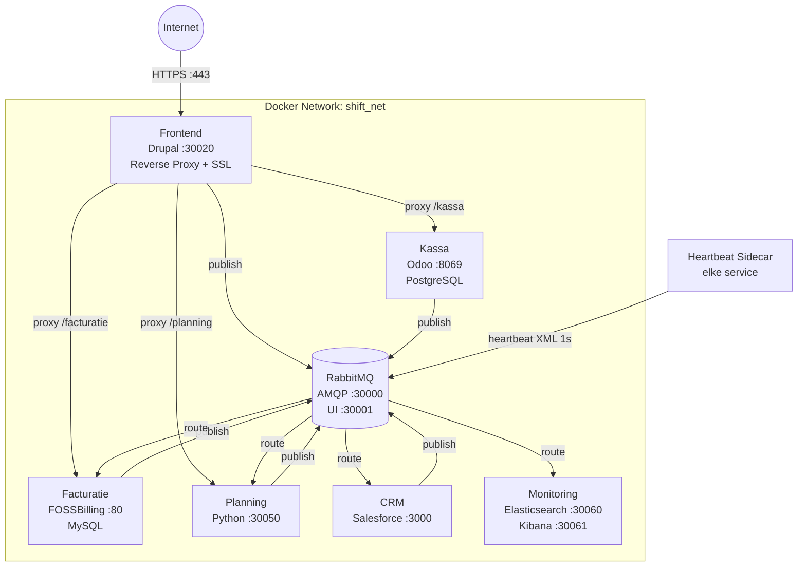

<div align="center">


<br/>

[](https://azure.microsoft.com)
[](https://docker.com)
[](#)
[](#)
[](https://github.com/IntegrationProject-Groep1/.github/actions/workflows/generate-badges.yml)

</div>

---

## Over Dit Project

**ShiftFestival** is het geïntegreerde evenementenplatform van de Desideriushogeschool, uitgewerkt door Integratieproject Groep 1. Het platform beheert de volledige levenscyclus van een netwerkevenement: van online inschrijving en sessieplanning tot kassabeheer, facturatie en CRM-opvolging.

Het systeem draait op een **Azure VM** met een gedistribueerde **Docker-architectuur**. Alle microservices communiceren asynchroon via **RabbitMQ** en zijn geïsoleerd in het interne Docker-netwerk `shift_net`. SSL-terminatie en reverse-proxy worden gecentraliseerd afgehandeld door de Drupal-frontend op poort 443.

> **Doel van het opleidingsonderdeel:** analyseren van klantbehoeften en deze omzetten naar een werkend, geïntegreerd prototype waarbij elke service automatisch data uitwisselt met de rest van het IT-landschap — zonder downtime en zonder handmatige synchronisatie.

---

## Architectuur



---

## Organisatiestructuur

```
IntegrationProject-Groep1
│
├── Project Managers (PM)
│   ├── Denis Dario
│   └── [PM 2 — naam invullen]
│
├── Team Frontend  (TL: Charles Wong)
│   ├── Jarno Janssens   — Developer / Tester
│   ├── Ilyas Fariss     — Developer / Tester
│   └── Dries Michiels   — Developer / Tester
│
├── Team Kassa  (TL: Dang Enwing)
│   ├── [Developer / Tester — naam invullen]
│   └── [Developer / Tester — naam invullen]
│
├── Team Facturatie  (TL: [naam invullen])
│   ├── [Developer / Tester — naam invullen]
│   └── [Developer / Tester — naam invullen]
│
├── Team CRM  (TL: [naam invullen])
│   ├── [Developer / Tester — naam invullen]
│   └── [Developer / Tester — naam invullen]
│
├── Team Planning  (TL: [naam invullen])
│   ├── [Developer / Tester — naam invullen]
│   └── [Developer / Tester — naam invullen]
│
└── Team Monitoring  (TL: [naam invullen])
    ├── [Developer / Tester — naam invullen]
    └── [Developer / Tester — naam invullen]
```

---

## Teams

### Team Frontend


[](#)
[](#)
[](#)

**Repository:** [IP-groep1-frontend](https://github.com/IntegrationProject-Groep1/IP-groep1-frontend)  
**Team Lead:** Charles Wong · **Devs:** Jarno Janssens, Ilyas Fariss, Dries Michiels

De publieke voordeur van het platform. Drupal 10 verzorgt de bezoekerswebsite waar deelnemers zich kunnen inschrijven voor sessies. De container fungeert tevens als SSL-terminatie en reverse proxy: alle HTTPS-verkeer op poort 443 wordt doorgestuurd naar de juiste interne dienst.

| Poort | Rol |
|-------|-----|
| `30020` | HTTP (intern / lokaal) |
| `443` | HTTPS (via Azure-proxy) |
| `30000` | RabbitMQ AMQP (outbound) |

**Berichtenstromen (RabbitMQ):**
- `frontend.user.registered` naar CRM (nieuwe inschrijving)
- `frontend.user.checkin` naar Kassa / CRM (check-in aan de kassa)
- `frontend.session.update` ontvangen van Planning

---

### Team Kassa


[](#)
[](#)
[](#)

**Repository:** [Kassa](https://github.com/IntegrationProject-Groep1/Kassa)  
**Team Lead:** Dang Enwing · **Devs:** [naam invullen], [naam invullen]

Het fysieke kassasysteem tijdens het festival. Odoo 17 Point-of-Sale verwerkt consumptiebestellingen en registreert betalingen. Een Python-integratiecontainer communiceert via de Odoo XML-RPC API om verkoopdata door te sturen naar de rest van het platform — zonder dat er code in Odoo zelf geschreven wordt.

| Poort | Rol |
|-------|-----|
| `8069` | Odoo Web UI + XML-RPC API |
| `5432` | PostgreSQL (intern) |

**Berichtenstromen (RabbitMQ):**
- naar CRM: consumptie gekoppeld aan klant
- naar Facturatie: betaling verwerkt (trigger factuurstatus)

---

### Team Facturatie


[](#)
[](#)
[](#)

**Repository:** [Facturatie](https://github.com/IntegrationProject-Groep1/Facturatie)  
**Team Lead:** [naam invullen] · **Devs:** [naam invullen], [naam invullen]

De financiële backbone van het platform. FOSSBilling maakt automatisch facturen aan voor bedrijven op basis van inschrijvingen en consumptiedata van de Kassa. Bij annuleringen worden creditnota's aangemaakt. Na afloop van het event worden alle openstaande facturen automatisch gesloten en doorgestuurd naar het mailingteam.

| Poort | Rol |
|-------|-----|
| `80` | FOSSBilling Web UI (intern) |
| `3306` | MySQL (intern) |

**Berichtenstromen (RabbitMQ):**
- van CRM: inschrijving / consumptie / betaling / annulering
- naar Mailing: factuur klaar voor verzending
- naar DLQ: foutieve berichten (Dead Letter Queue)

---

### Team CRM


[](#)
[](#)

**Repository:** [CRM](https://github.com/IntegrationProject-Groep1/CRM)  
**Team Lead:** [naam invullen] · **Devs:** [naam invullen], [naam invullen]

Het geheugen van het platform. Salesforce slaat alle contacten (personen en bedrijven) op en houdt activiteiten bij. Een Node.js-consumer luistert op RabbitMQ en synchroniseert binnenkomende data automatisch naar Salesforce. Na het event kunnen de contactlijsten gebruikt worden om zakelijke relaties verder uit te bouwen.

| Poort | Rol |
|-------|-----|
| `3000` | CRM Receiver API (intern) |
| `5672` | RabbitMQ AMQP (intern) |
| `15672` | RabbitMQ Management UI |

**Berichtenstromen (RabbitMQ):**
- van Frontend: nieuwe inschrijving
- van Kassa: betaling / consumptie
- naar Facturatie: klantgegevens doorgeven
- naar Mailing: contactlijsten aanleveren

---

### Team Planning


[](#)
[](#)

**Repository:** [Planning](https://github.com/IntegrationProject-Groep1/Planning)  
**Team Lead:** [naam invullen] · **Devs:** [naam invullen], [naam invullen]

Beheert de sessie-agenda van het event. De service ontvangt `calendar.invite`-berichten en publiceert `session.created`-events naar andere teams. Via de Microsoft Graph API (OAuth 2.0) kunnen sessies rechtstreeks als event in de Outlook-kalender van een deelnemer worden aangemaakt.

| Poort | Rol |
|-------|-----|
| `30050` | Health endpoint + API |
| `30000` | RabbitMQ AMQP (outbound) |

**Berichtenstromen (RabbitMQ):**
- van Frontend: `calendar.invite`
- naar alle teams: `planning.session.created`

---

### Team Monitoring


[](#)
[](#)
[](#)

**Repository:** [Monitoring](https://github.com/IntegrationProject-Groep1/Monitoring)  
**Team Lead:** [naam invullen] · **Devs:** [naam invullen], [naam invullen]

De controlroom van het platform. De ELK-stack (Elasticsearch + Logstash + Kibana) ontvangt elke seconde een XML-heartbeat van elke service via RabbitMQ. Logstash parsed en indexeert de data; Kibana visualiseert de uptime van alle teams in realtime. Berichten met ongeldige XML of onbekende systemen gaan naar een quarantine-index.

| Poort | Rol |
|-------|-----|
| `30060` | Elasticsearch REST API |
| `30061` | Kibana Dashboard UI |

**Gemonitorde systemen:** `frontend` · `kassa` · `facturatie` · `crm` · `planning` · `monitoring`

---

### Heartbeat Sidecar


[](#)
[](https://github.com/IntegrationProject-Groep1/heartbeat/pkgs/container/heartbeat)

**Repository:** [heartbeat](https://github.com/IntegrationProject-Groep1/heartbeat)

Een gedeelde sidecar-container die elk team toevoegt aan zijn eigen `docker-compose.yml`. De sidecar controleert elke seconde of de opgegeven containers bereikbaar zijn via TCP en stuurt een heartbeat-XML naar RabbitMQ. Team Infrastructuur beheert de deployments via Watchtower — nieuwe versies worden automatisch uitgerold.

```yaml
# Toevoegen aan jullie docker-compose.yml:
sidecar:
  image: ghcr.io/integrationproject-groep1/heartbeat:latest
  environment:
    - SYSTEM_NAME=jullie-systeem-naam   # bijv. kassa / crm / planning
    - TARGETS=container-naam:poort
    - RABBITMQ_HOST=rabbitmq_broker
    - RABBITMQ_USER=<username>
    - RABBITMQ_PASS=<password>
```

---

## Poortenoverzicht

| Team | Service | Host-poort | Gebruik |
|------|---------|-----------|---------|
| Frontend | Drupal (HTTP) | `30020` | Web UI & registratie |
| Frontend | Apache (HTTPS proxy) | `443` | SSL-terminatie & reverse proxy |
| Kassa | Odoo Web + XML-RPC | `8069` | Point of Sale UI & API |
| Facturatie | FOSSBilling | `80` (intern) | Factuur-beheer UI |
| CRM | Node.js Receiver | `3000` | CRM-integratie API |
| Planning | Python Health/API | `30050` | Health endpoint & planning API |
| Monitoring | Elasticsearch | `30060` | REST API (intern) |
| Monitoring | Kibana | `30061` | Dashboard UI |
| Infra | RabbitMQ AMQP | `30000` | Berichtenwachtrij (AMQP) |
| Infra | RabbitMQ Management | `30001` | Beheer UI |

---

## Repositories

| Repo | Technologie | Omschrijving |
|------|-------------|--------------|
| [IP-groep1-frontend](https://github.com/IntegrationProject-Groep1/IP-groep1-frontend) |  | Drupal 10 — publieke website, inschrijvingen, SSL proxy |
| [Kassa](https://github.com/IntegrationProject-Groep1/Kassa) |  | Odoo 17 Point of Sale + Python integratie |
| [Facturatie](https://github.com/IntegrationProject-Groep1/Facturatie) |  | FOSSBilling — facturen, creditnota's, betalingen |
| [CRM](https://github.com/IntegrationProject-Groep1/CRM) |  | Salesforce CRM — contactbeheer & mailinglijsten |
| [Planning](https://github.com/IntegrationProject-Groep1/Planning) |  | Sessieplanning + Microsoft Graph API (Outlook) |
| [Monitoring](https://github.com/IntegrationProject-Groep1/Monitoring) |  | ELK Stack — realtime uptime dashboard |
| [heartbeat](https://github.com/IntegrationProject-Groep1/heartbeat) |  | Gedeelde heartbeat sidecar voor alle teams |
| [.github](https://github.com/IntegrationProject-Groep1/.github) |  | Org-profiel, badge-generator & workflows |

---

<div align="center">

Badges worden automatisch gegenereerd via GitHub Actions + Go — zie [`badge-generator/`](https://github.com/IntegrationProject-Groep1/.github/tree/main/badge-generator)

[](https://github.com/IntegrationProject-Groep1/.github/actions/workflows/generate-badges.yml)

</div>
